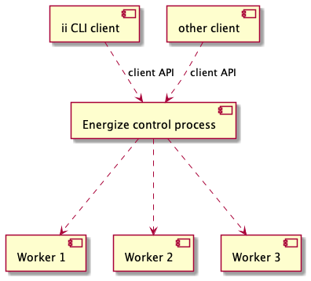
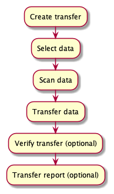

# Energize design

This page describes the design principles, components and process model of Energize.

# Principles

* Although Energize will initially be controlled using a CLI, the client interface should
  be flexible enough to support other clients, such as a desktop application.
* The main functionality of Energize is intended to be platform independent. 
* Energize should be able to use multiple backend tools for the actual data transfer, such
  as python-irodsclient, iput, irsync and possibly WebDAV

# Components

Clients communicatie with the Energize control process using a client API. The control process
starts and manages worker processes that perform the actual tasks.

# Process model

A transfer consists of the following steps:
1. Create transfer: this initializes a file for keeping track of the transfer and checks the connection to the remote iRODS host.
2. Selecting data to transfer
3. Scanning the data: registering file names, file sizes and checksums
4. Data transfer &emdash; this step can be gracefully halted and resumed.
5. Transfer verification &emdash; this step is optional.
6. Transfer report generation &emdash; this step is optional.

