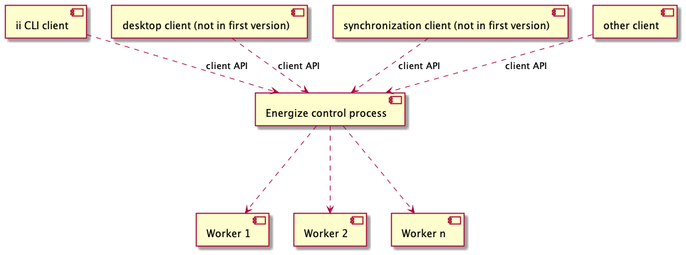

# Energize design

This page describes the design principles, components and process model of Energize.

# Purpose

Energize is an abstraction layer that implements reliable data transfer
to and from iRODS. The main use cases are:
- Working around software bugs, for example by partitioning
  transfers of large number of files in multiple parts to limit the
  impact of memory leaks.
- Restarting transfers after network issues and keeping track of what
  data has been transferred previously.
- Facilitating transfer of data in batches, for example if a researcher
  intends to upload data from a laptop at night, and temporarily halt
  the transfer during the daytime.
- Generating reports of data transfers for provenance tracking

# Principles

* Although Energize will initially be controlled using a CLI, the architecture should
  be flexible enough to support other clients, such as a desktop application and a
  synchronization client for research environments.
* The core functionality of Energize is intended to be platform independent. 
* Energize should be able to use multiple backend tools for the actual data transfer, such
  as python-irodsclient, iput, irsync and possibly WebDAV

# Components

Clients communicate with the Energize control process using a client API. The control process
starts and manages worker processes that perform the actual tasks.

# Process model

A transfer consists of the following steps:
1. Create transfer: this initializes a file for keeping track of the transfer and checks the connection to the remote iRODS host.
2. Selecting data to transfer
3. Scanning the data: registering file names, file sizes and checksums
4. Data transfer &emdash; this step can be gracefully halted and resumed.
5. Transfer verification &emdash; this step is optional.
6. Transfer report generation &emdash; this step is optional.

# Open questions

The process model above has separate steps for scanning the data (e.g. computing checksums), transferring the data and verifying
the data transfer. One advantage of having separate steps is that it would facilitate clean comparisons of the state
before and after a transfer, which is useful for keeping track of data provenance. Furthermore, this makes it possible
to inform the user about progress of the transfer, e.g. using a progress bar.

This setup is suitable for transferring static data, but less so for synchronization of data that is being edited. We may
need to incorporate a transfer mode with integrated scanning, transfer and verification steps in the process model at
a later time. This could be useful for synchronizing data in a research environment with data in Yoda.
